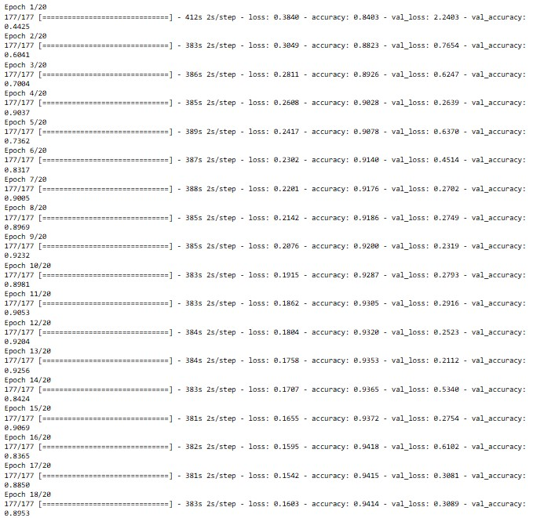
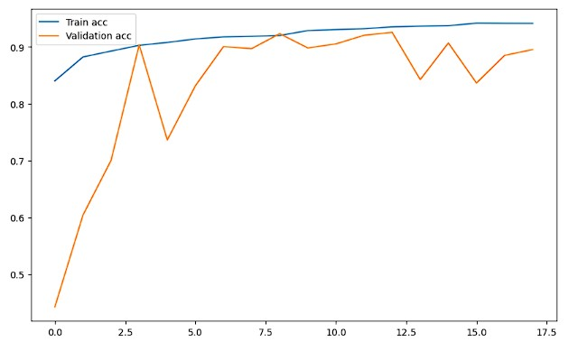
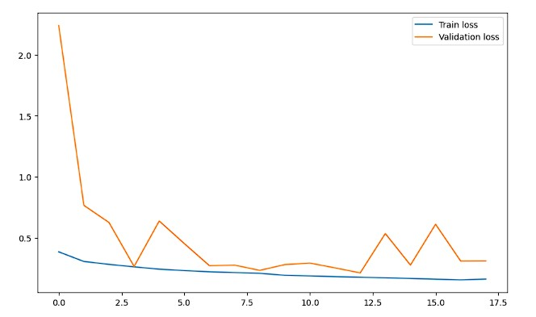

# Machine-Learning

In this project, we make a model to detect images to know what waste is shown by user, and we classify it into organic and non-organic.
Our model uses the dataset from https://www.kaggle.com/datasets/techsash/waste-classification-data, we trained with 25 epochs and we used an early stopping monitor that will stop training if the validation loss does not improve after 5 epochs. The train stopped at 18/20 with accuracy reaching 92.56%.

We got the result:

